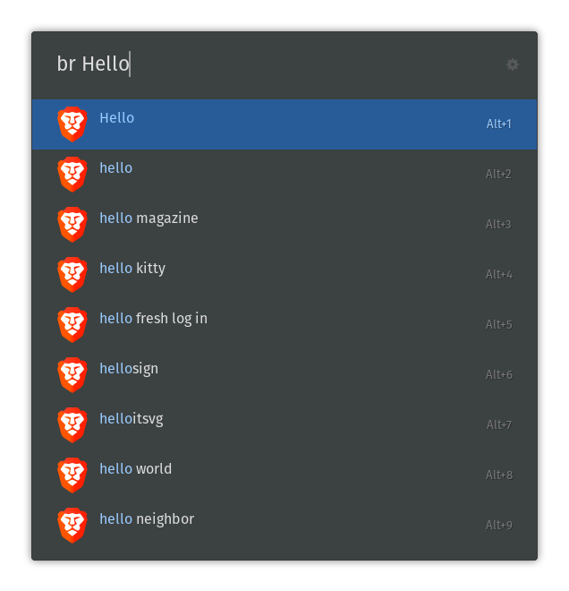

# Brave Ulauncher extension



This Ulauncher extension enables you to use the Brave search.

## Install

Then open Ulauncher preferences window > extensions > add extension and paste the following url:

```
https://github.com/Pegoku/ulauncher-brave
```

## Credits

### Original Idea:
```
https://github.com/mikebarkmin/ulauncher-duckduckgo
```
